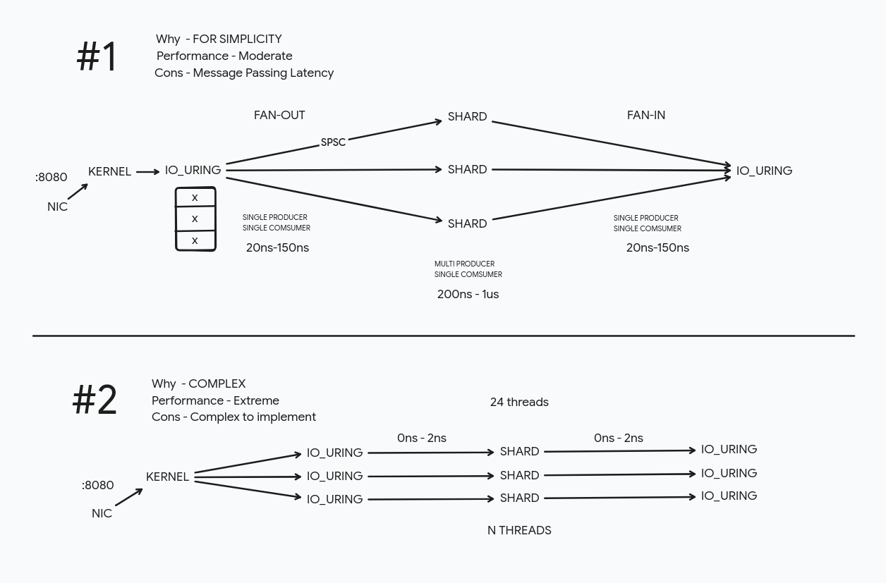

# P2P Networking in RUST [File Transfering]

## Library Used & Why
  - For structured events of logs - `tracing, tracing_subscriber`
  - Runtime for both peer & relay - `tokio`
  - Generating random session code - `uuid` 
  - Serializing packet struct into bytes - `serde`
  - Error Handling - `anyhow`
  - Zero Copy async IO - `io_uring`

## Installation & Running

- Download the release for your platform from the repo

- Start the server -> `server.exe --port <PORT>` & open the port in the firewall.

- Start a Session -> `peer.exe --mode <MODE> --addr <IP:PORT>`
- Share the code with other peer -> `peer.exe --mode <MODE> --addr <ADDR> --code <UUID>`
- File transfering begins 

## Rendezvous Server ( Information Sharing ) + STUN SERVER
A information exchaning server. Its primary goal is to share two parties network information (IP:PORT) with each other using a UUID code.  

    - Host : Creates a session on server which in return get a UUID code.

    - Peer/Client : Connects to that session using UUID code, There network information gets exchanged. 

## Client
It is the initiator thats starts the file transfering process. Creating a session in the stun server, Hole Punching through NAT, receives file packets into buffer and write into disk now and then. 

 * Initialize the file transfering
 * Hole Punch NAT 
 * Fall back to turn server if p2p fails.
 * Receive incoming packets , decompress them , chunk them in order , write to disk. Reliable delivery and ordering of packets are handled by Reliable UDP layer (for more info on that find it below)

## Reliable UDP 
As the name suggest it does something with making UDP reliable. But what even is reliable. It simply means "If I tell you to do something, you do that no mistakes." So I have made the UDP reliable for (a) guarentee delivery of packets (b) in-order arriving of packets.

## Hole Punching (NAT)
This process runs on both side (simultaneous) whether its a host or peer, starts sending packets to other side using their IP:PORT which creates __mapping table__ (process in NAT which allows incoming packets coming from the same port from where we have send the initial request from) in their router, creating a connection with two side that stays open as long as we keep sending packets. This process needs to be done quickly on both side as nat keeps that mapping for approx 30-60 seconds.

## Fallback (TURN Server)
It handles the relaying of packets between the peers in case the p2p fails.

I have implemented FAN-OUT FAN-IN approach for now. Where all the incoming packets gets passed onto to each shard by the shard router and later get passed to the io_uring_loop to send the packet away.

## Architecture design

